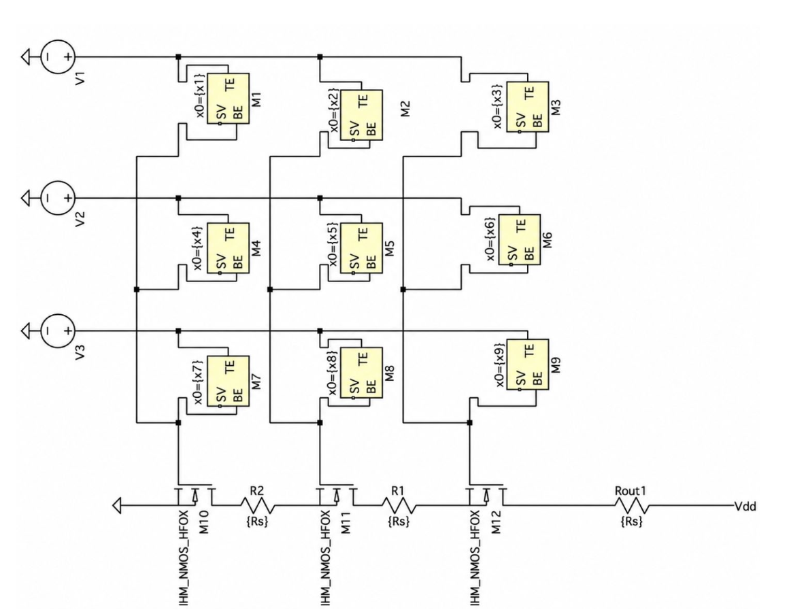
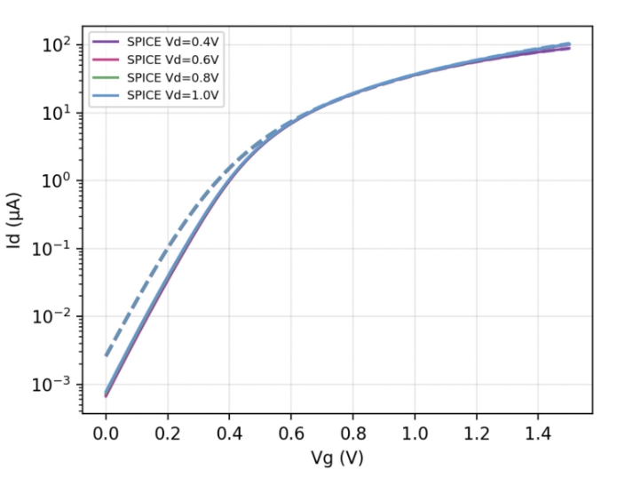
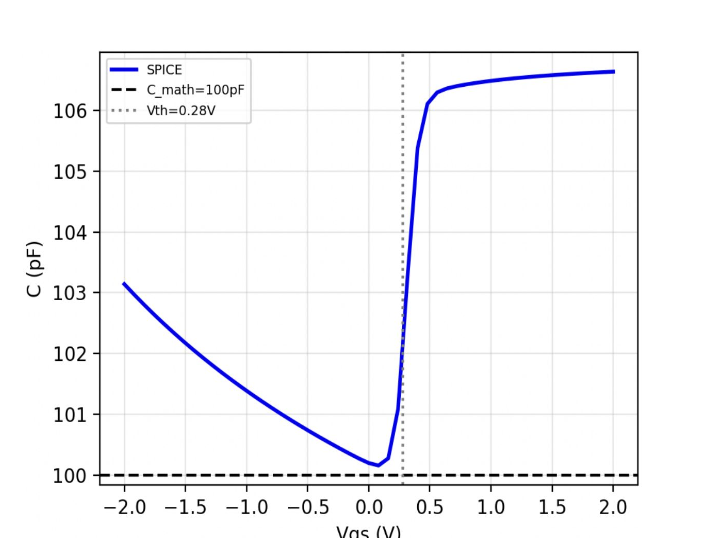
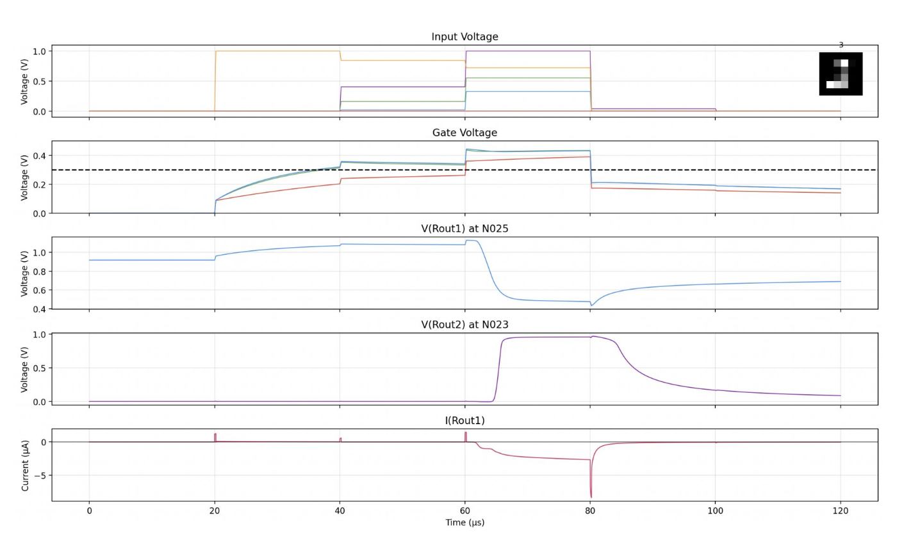
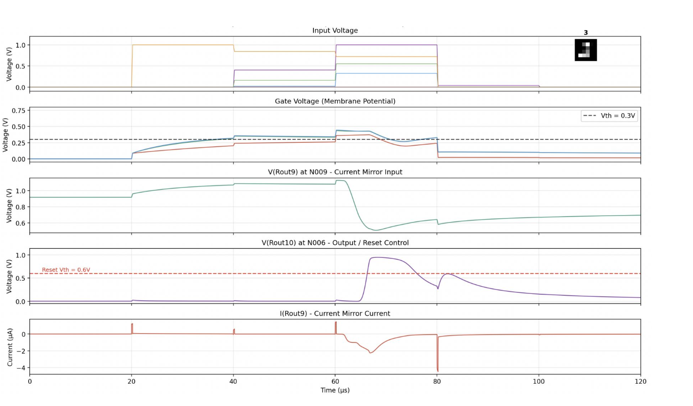
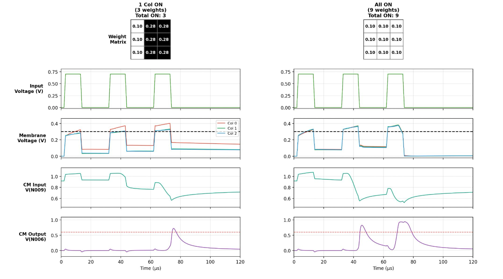
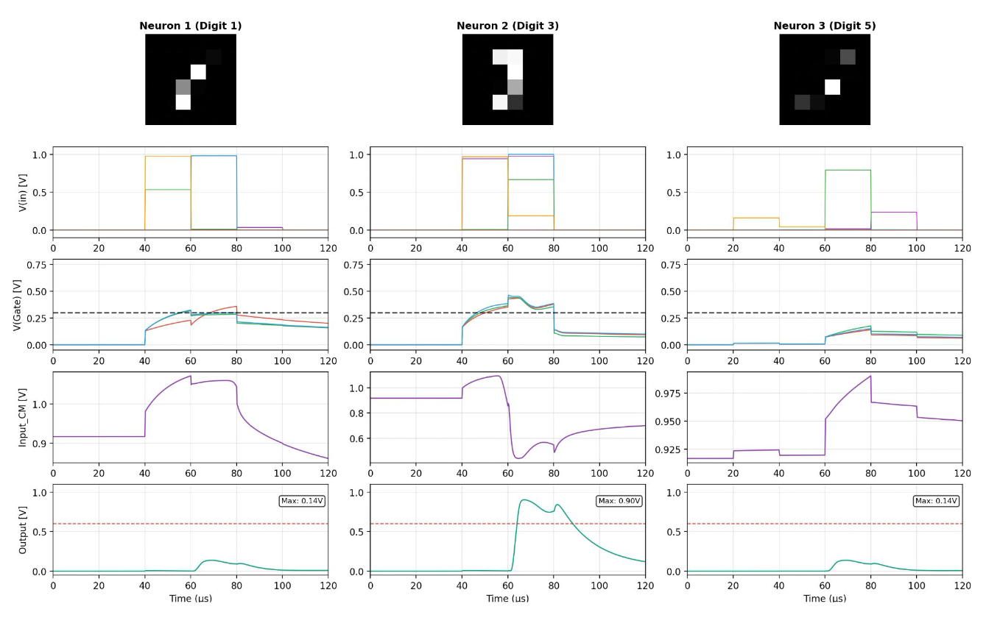
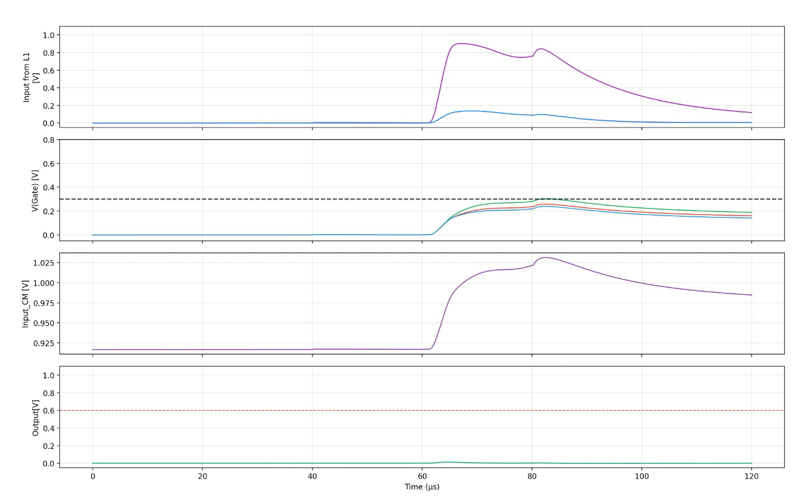

# Neuro-Transistor Circuit Design and Simulation

This project studies a neuro-transistor circuit for spiking neural networks. A neuro-transistor behaves like a hardware leaky integrate-and-fire neuron: input spikes pass through memristive synapses, charge the gate/membrane capacitance, and produce an output spike when the membrane voltage crosses the transistor threshold.



## Problem

The basic neuro-transistor concept can reproduce membrane integration, but it has several practical issues before it can be used in a connected spiking neural network:

- there was no complete mathematical model for predicting the circuit behavior,
- NMOS model parameters had to be extracted and verified,
- the high-impedance gate node was disturbed when directly connected to another circuit,
- the membrane voltage did not reset after firing,
- and multi-layer spike propagation had to be validated.

## What Was Implemented

The project solves these problems by developing a mathematical model, validating NMOS behavior with EKV-based equations, extracting Id-Vg, Id-Vd, and C-V characteristics, adding a PMOS current mirror, implementing a reset circuit, and connecting three input neuro-transistors to one output neuro-transistor.

## Results

### NMOS Model Validation



The NMOS behavior was verified using Id-Vg and Id-Vd characteristics. Extracted parameters such as threshold voltage and gate coupling were used in the neuro-transistor model.

### C-V Characteristics



The C-V analysis showed that the membrane capacitance is approximately constant around the operating region, with an extracted value of about 100 pF.

### Current Mirror Output



The PMOS current mirror isolates the high-impedance gate node from the next stage. It also provides current gain based on the PMOS width ratio, approximately 94/24 = 3.9.

### Reset Circuit



The reset circuit discharges the membrane after a spike. This allows the neuron to return close to baseline and fire again instead of staying continuously charged.

### Weight Configuration Testing



Different ON/OFF memristor weight configurations were tested. The circuit produced spike-and-reset behavior across the tested cases, while also showing that input scaling is important because strong inputs can make weak/OFF states fire.

### Connected Layer: Three Input Neurons



Three input neuro-transistors were driven by MNIST-based pulse trains. Each neuron integrated its input and generated output spikes for the next layer.

### Connected Layer: Output Neuron



The fourth neuron received spikes from the three input neurons, integrated them, and fired. This verifies feedforward spike propagation through a small connected neuro-transistor network.

## Conclusion

The project shows that the neuro-transistor can be modelled, improved, and connected into a small spiking neural network. The mathematical model predicts neuron behavior, the current mirror solves gate-node loading, the reset circuit enables repeated firing, and the connected-layer simulation demonstrates multi-neuron spike propagation.

## How To Run

Install the required Python packages:

```bash
python3 -m pip install numpy scipy matplotlib PySpice
```

PySpice also requires ngspice.

Run the simulations:

```bash
python3 reset_on_off_cases.py
python3 current_mirror_circuit_14_mnsit.py
python3 reset_neurotransistor_14_mnist.py
python3 fully_connected_mnist_reset_14.py
```

For MNIST-based simulations, place the MNIST gzip files in a folder named `raw/`:

```text
raw/
  train-images-idx3-ubyte.gz
  train-labels-idx1-ubyte.gz
```
